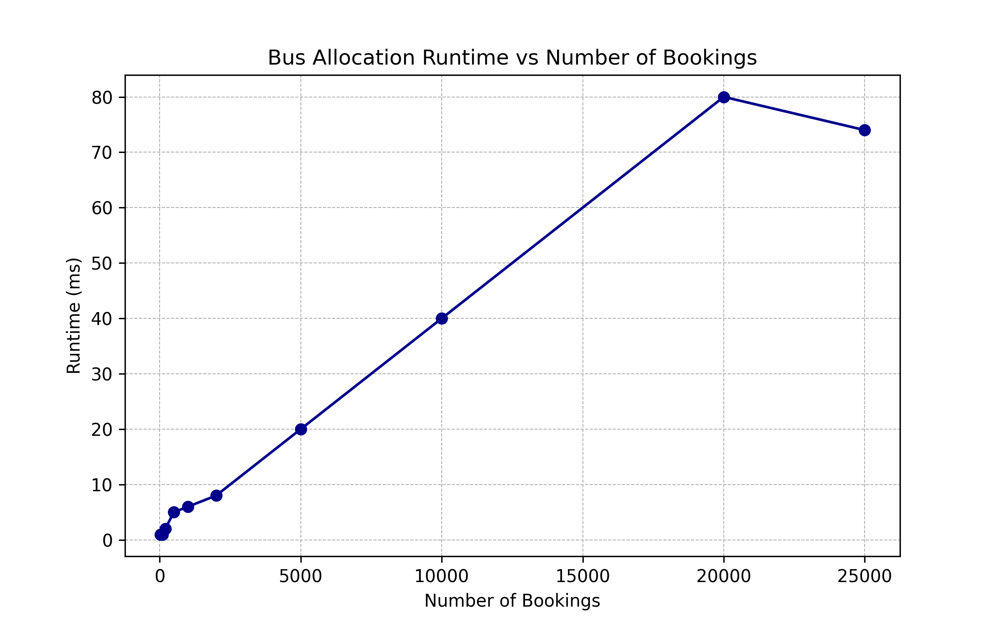
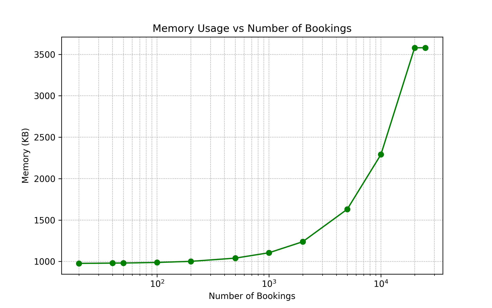
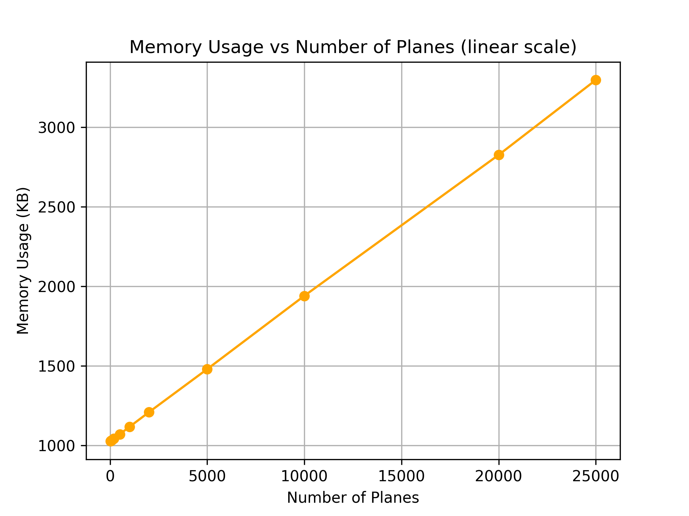
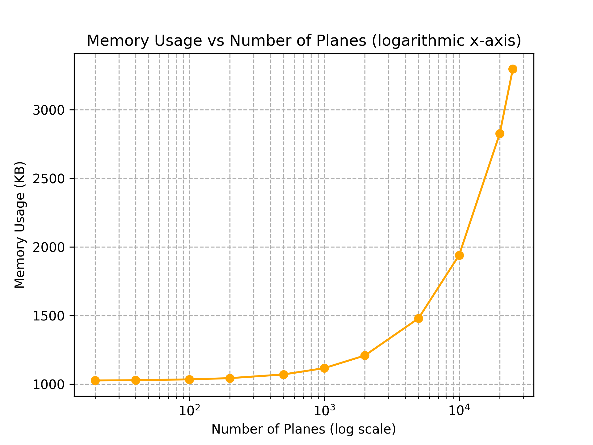
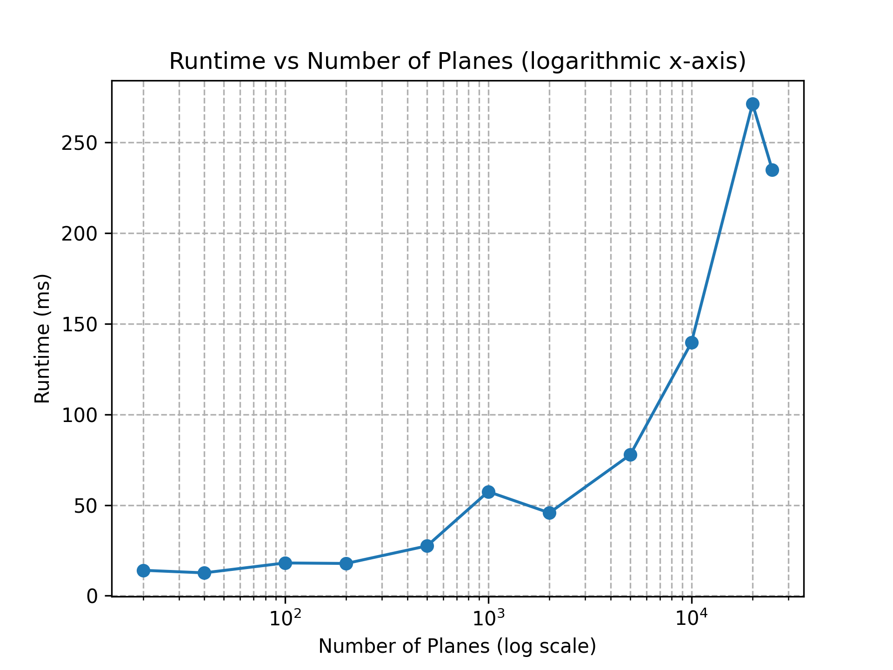

# AOA Project 1 - Simulation

This project contains Java implementations for bus allocation and 3D closest pair simulations. It provides simulators to evaluate performance, memory usage, and runtime under varying data inputs.

## Project Files

- `BusSimulation.java` – Simulator for bus bookings.
- `GreedyBusAllocator.java` – Implements a greedy strategy for allocating bus seats.
- `ClosestPair3D.java` – Computes the closest pair of points in 3D space.
- `ClosestPairSimulator.java` – Simulator to test the closest pair algorithm.

## Data Files

The simulators use synthetic data provided in the following CSV files:

- `flights.csv`
- `bus_bookings.csv`

## Technical Setup

### Compilation

Compile all Java files using:

```bash
javac *.java
```

### Usage

Run the simulators as follows:

**Bus Simulation:**

```bash
java BusSimulation <csv-file> <no-bookings-to-use>
```

**Closest Pair Simulation:**

```bash
java ClosestPairSimulator <csv_file> <num_records>
```

Replace `<csv-file>` with the path to your CSV file and `<no-bookings-to-use>` / `<num_records>` with the number of records you want to process.

## Synthetic Data

The CSV files contain synthetic datasets used to test and benchmark the simulators. These datasets were generated to mimic real-world flight and bus booking scenarios, allowing experimentation with various sizes and configurations.

## Results

Simulation results are summarized in the plots provided below.

### Bus Simulation

**Memory vs Bookings**


**Runtime vs Bookings**


**Runtime vs Bookings (Log Scale)**


**Memory vs Bookings (Log Scale)**


### Closest Pair Simulation


**Memory vs Number of Planes**

**Memory vs Number of Planes (Log Scale)**


**Time vs Number of Planes**

**Time vs Number of Planes (Log Scale)**

